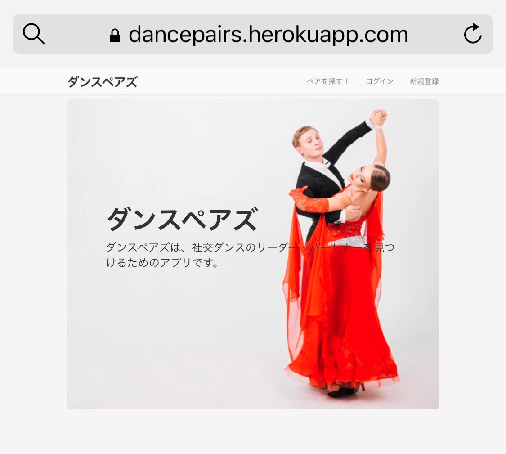
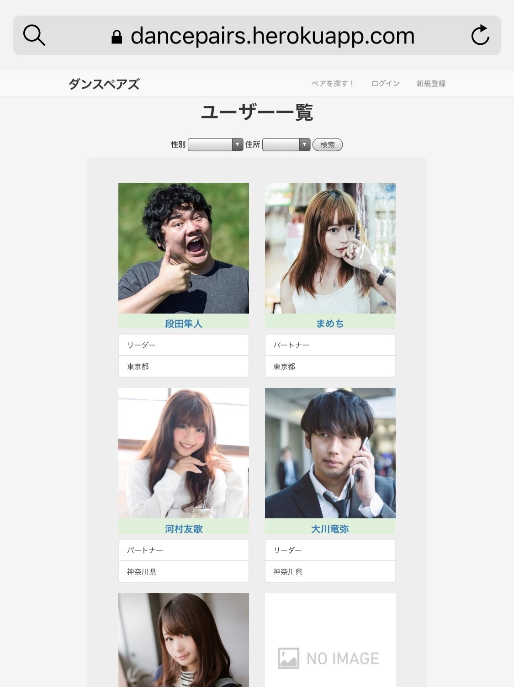
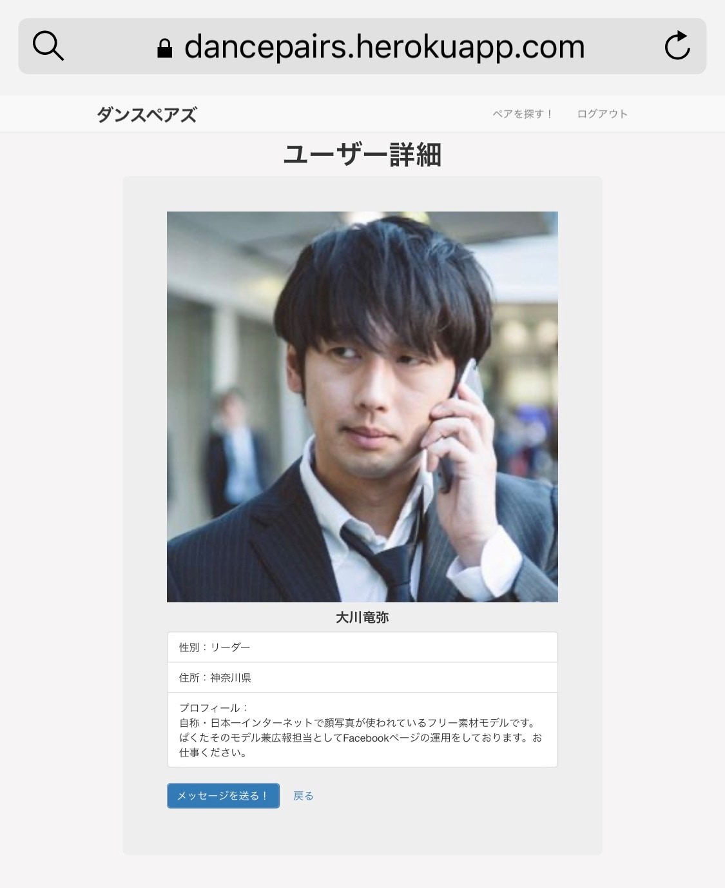
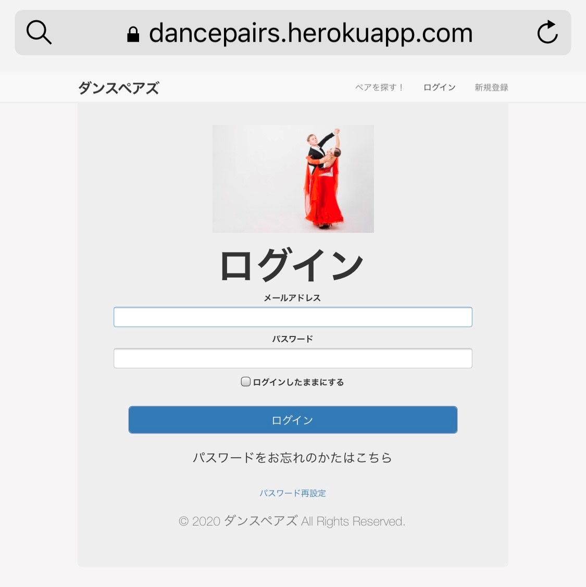
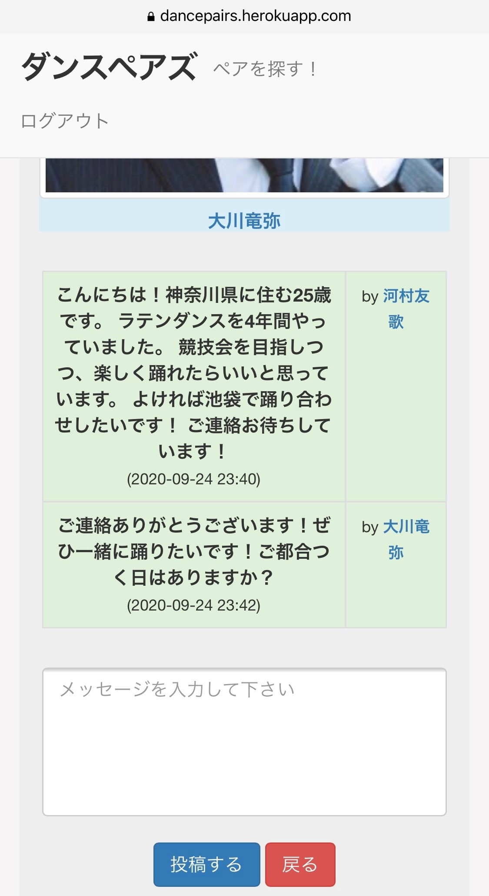

# Name

ダンスペアズ

# DEMO







# Features

ダンスペアズは、社交ダンスのリーダー・パートナーを見つけるアプリです。
従来の社交ダンスリーダーパートナー掲示板は、検索や絞り込みの機能には長けているものの、それ故の使いづらさも否めません。
また、ページがごちゃごちゃしていて使いにくいと感じます。
ダンスペアズは、直感的に・簡単に・素早くダンスパートナーを見つけることができます。
また、気になる人とDM(ダイレクトメッセージ)でやり取りすることが可能です。

* 基本的なCRUD機能
* 基本的なログイン・ログアウト機能
* ユーザー一覧の検索機能(絞り込み)
* AWS S3を使った本番環境でのプロフィール画像投稿機能
* DM(ダイレクトメッセージ)機能

# Requirement

* ruby 2.6.3p62 [x86_64-linux]
* Rails 6.0.3

# Setup

このアプリケーションを動かす場合は、まずはリポジトリを手元にクローンしてください。
その後、次のコマンドで必要になる RubyGems をインストールします。

```
$ bundle install --without production
```

その後、データベースへのマイグレーションを実行します。

```
$ rails db:migrate
```

最後に、テストを実行してうまく動いているかどうか確認してください。

```
$ rails test
```

テストが無事に通ったら、Railsサーバーを立ち上げる準備が整っているはずです。

```
$ rails server
```

※ テストはまだ未実装です。アップデートで実装しますのでお待ちください。

# Usage

ユーザー登録をして、ログインします。マイページで詳細なプロフィールを記入します。「ペアを探す！」から気になる人を見つけてメッセージを送ってみましょう。

# Note

* Herokuにデプロイしています。
https://dancepairs.herokuapp.com/
* 実装していない部分は随時アップデートしていきます。

# Author

* 高橋青
* 青山学院大学理工学部経営システム工学科
* jo.takahashi.0120@gmail.com

# License

© 2020 ダンスペアズ All Rights Reserved.
[MIT](https://github.com/tcnksm/tool/blob/master/LICENCE)

# References

* Ruby on Railsチュートリアル
https://railstutorial.jp/?version=6.0